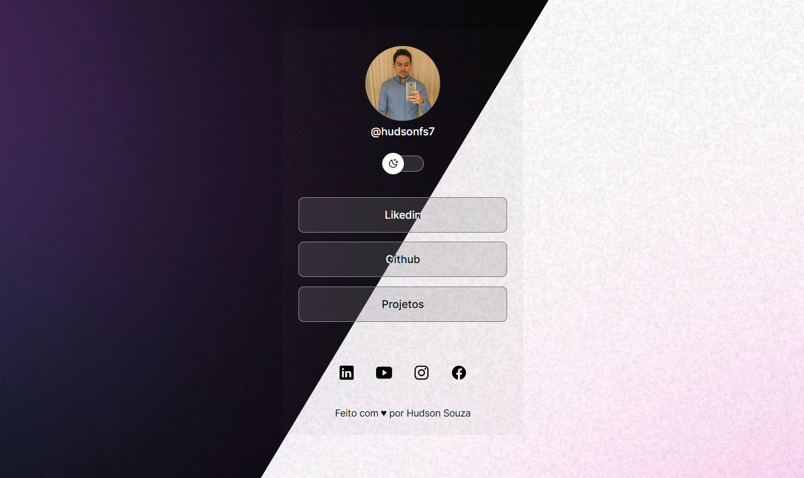

<h1 align="center">DevLinks 👋</h1>

  
  

> Theme based on Launchbase colors. [Tiago Luchtenberg](https://www.linkedin.com/in/tiago-luchtenberg-0b9a3b97)

### 🏠 [Homepage](https://github.com/hudsonfs7)

## Author

👤 **Hudson Souza**

- Github: [@hudsonfs7](https://github.com/hudsonfs7)
- LinkedIn: [@hudsonsouza](https://www.linkedin.com/in/hudson-souza-5a8bb4154/)

 

👤 **Usage**

- HTML
- CSS
- JavaScript

 

> Criado com base no projeto do Mayk Brito. [Thanks, Mayk Brito](https://twitter.com/maykbrito7)
